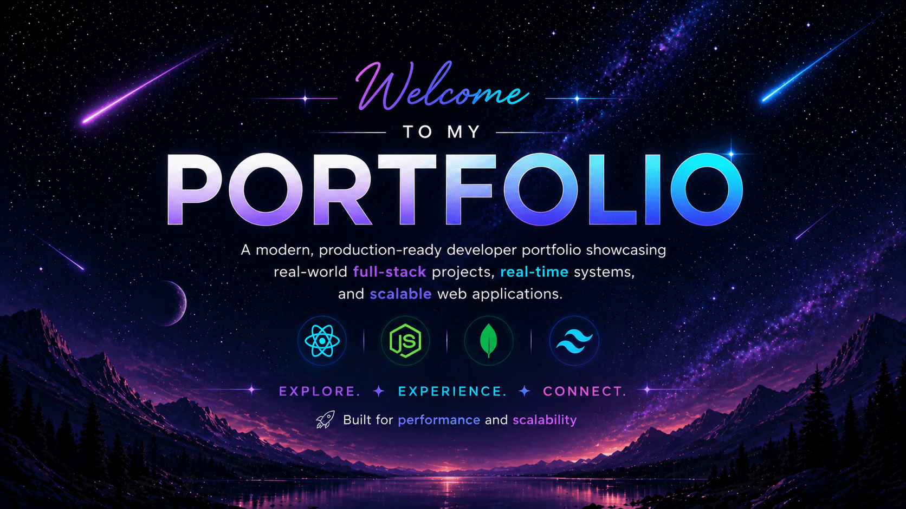

# 🧑‍💻 Aarsh Portfolio

⚡ Interactive portfolio showcasing real-world full-stack projects and scalable systems.

<p align="center">
  
</p>

🔗 **Live Demo:** https://aarshportfolio1.netlify.app/

---


---

## 🚀 Overview   

This portfolio showcases real-world MERN stack applications with a focus on performance, scalability, and intuitive user experience.  
It highlights projects featuring real-time systems, efficient data handling, and production-grade architecture.

---

## 🏆 Highlights  

- Built and deployed production-ready portfolio with modern UI/UX  
- Showcases real-time and full-stack projects with scalable architecture  
- Designed with performance, accessibility, and responsiveness in mind

---

## ✨ Key Features  

- 🎯 Clean, responsive UI with modern design  
- ⚡ Smooth animations using Framer Motion  
- 🌙 Dark/Light mode with persistence  
- 📂 Dynamic project showcase with live + GitHub links  
- 📱 Fully responsive across all devices  
- 🚀 Optimized for performance and fast load times  
- ♿ Implemented accessibility and SEO best practices (meta tags, structured content)
- 📊 Integrated analytics tracking for user interactions and performance insights 

---

## 🛠 Tech Stack

- **Frontend:** React, Vite, Tailwind CSS  
- **Animations:** Framer Motion  
- **Routing:** React Router  
- **UI & Icons:** Lucide React, React Icons  
- **Deployment:** Netlify  

---


## 🧠 What I Focused On

* Building a clean and intuitive user experience
* Structuring scalable and reusable components
* Optimizing performance and responsiveness
* Creating a visually engaging and modern interface

---

## 🚀 Future Improvements  

- Add backend-powered contact form  
- Project detail pages with deeper insights  
- Enhance accessibility auditing and SEO optimization  

---

## 📁 Project Structure

```text
src/
 ├── Components/
 ├── data/
 ├── pages/
 ├── App.jsx
 └── main.jsx
```

---

## 📬 Contact

* 📧 Email: [aarshsinghas123@gmail.com](mailto:aarshsinghas123@gmail.com)
* 🔗 LinkedIn: https://www.linkedin.com/in/aarshsingh
* 💻 GitHub: https://github.com/Aarsh31248

---

